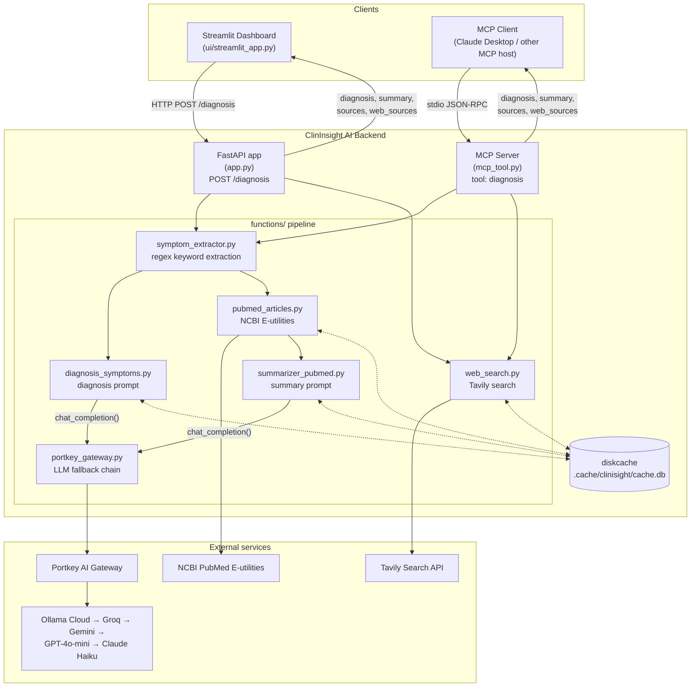
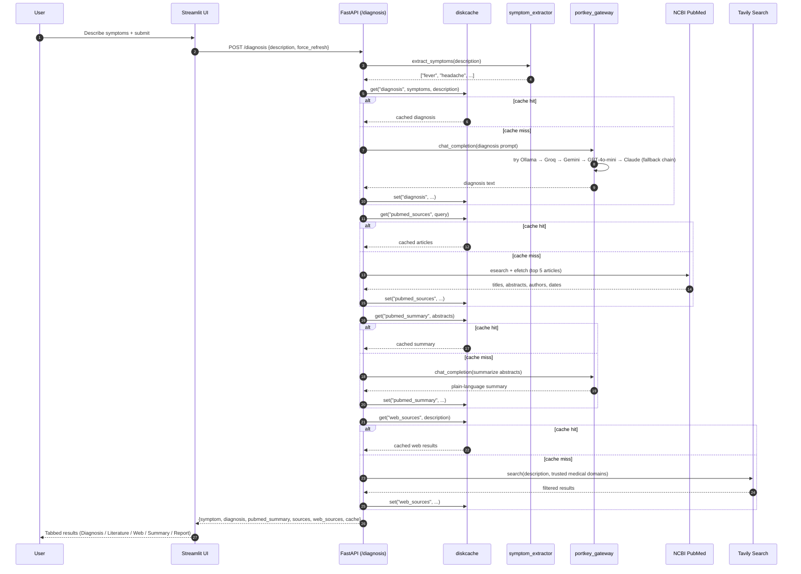
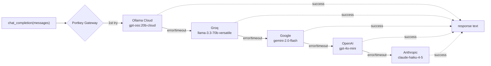

# ClinInsight AI

AI-assisted symptom triage: describe symptoms in plain language and get a possible-diagnosis
overview, a plain-language summary of relevant PubMed literature, and links to trusted medical
web sources — all backed by a disk-cached FastAPI backend, exposed to LLM tool-callers via an
MCP server, and fronted by a Streamlit dashboard.

> ⚠️ **Not a diagnostic device.** ClinInsight AI is informational only and is not a substitute
> for professional medical advice.

## Overview

The project has three independent entry points that share the same core pipeline
(`functions/`):

| Entry point | File | Protocol | Purpose |
|---|---|---|---|
| REST API | [app.py](app.py) | HTTP (FastAPI) | Backend used by the Streamlit UI or any HTTP client |
| MCP server | [mcp_tool.py](mcp_tool.py) | stdio (Model Context Protocol) | Exposes the same pipeline as a `diagnosis` tool to MCP-compatible LLM clients (Claude Desktop, etc.) |
| Dashboard | [ui/streamlit_app.py](ui/streamlit_app.py) | HTTP client → FastAPI | Human-facing UI: symptom intake form, tabbed results, history, exportable reports |

Both the API and the MCP server call into the same `functions/` modules and share the same
on-disk cache, so a symptom set diagnosed via one path is served from cache on the other.

## Architecture



## Request flow (`POST /diagnosis`)

Each stage checks the disk cache before doing any network/LLM work, and writes its result back
to the cache on a miss. `force_refresh: true` skips every cache read (but still writes fresh
results), which is what the UI's "Force refresh" checkbox sets.



## LLM fallback chain (Portkey gateway)

[functions/portkey_gateway.py](functions/portkey_gateway.py) routes every `chat_completion()`
call (diagnosis + summarization) through [Portkey](https://portkey.ai), which walks a fixed
fallback chain and returns the first provider that succeeds — so a single provider outage or
rate limit doesn't take the app down:



A `PORTKEY_CONFIG_ID` env var (a Portkey dashboard Config) overrides the in-code
`FALLBACK_CONFIG` when set, so the chain can be tuned centrally without a redeploy.

## Project structure

```
Clinisight_AI/
├── app.py                        # FastAPI backend — /diagnosis, /cache/clear, /cache/stats
├── mcp_tool.py                   # MCP server exposing the pipeline as a "diagnosis" tool
├── functions/
│   ├── symptom_extractor.py      # Regex-based symptom keyword extraction
│   ├── diagnosis_symptoms.py     # Diagnosis prompt → portkey_gateway
│   ├── pubmed_articles.py        # NCBI E-utilities search + fetch
│   ├── summarizer_pubmed.py      # Abstract summarization prompt → portkey_gateway
│   ├── web_search.py             # Tavily search restricted to trusted medical domains
│   ├── portkey_gateway.py        # Portkey client + 5-model fallback chain
│   └── cache_store.py            # diskcache-backed get/set/clear/stats helpers
├── ui/
│   └── streamlit_app.py          # Dashboard: intake form, tabs, history, report export
├── .cache/clinisight/            # diskcache DB (shared by API and MCP server)
├── .env.example                  # Required/optional environment variables
├── pyproject.toml / uv.lock      # uv-managed dependencies
└── requirements.txt              # pip-installable subset
```

## Setup

Requires Python 3.12+. Dependency management is via [uv](https://docs.astral.sh/uv/) (see
`pyproject.toml` / `uv.lock`); `requirements.txt` is provided for plain `pip` use.

```bash
# with uv (recommended)
uv sync

# or with pip
pip install -r requirements.txt
```

Copy `.env.example` to `.env` and fill in the keys you plan to use:

| Variable | Used by | Required |
|---|---|---|
| `PORTKEY_API_KEY` | `portkey_gateway.py` | Yes |
| `OLAMA_TOKEN` | Ollama Cloud (1st fallback target) | For that target |
| `GROQ_API_KEY` | Groq (2nd fallback target) | For that target |
| `GOOGLE_API_KEY` | Gemini (3rd fallback target) | For that target |
| `OPENAI_API_KEY` | GPT-4o-mini (4th fallback target) | For that target |
| `ANTHROPIC_API_KEY` | Claude Haiku (5th fallback target) | For that target |
| `PORTKEY_CONFIG_ID` | Overrides the in-code fallback chain | Optional |
| `TAVILY_API_KEY` | `web_search.py` | Yes, for web results |
| `HF_TOKEN` | Hugging Face access | Optional |
| `CLINISIGHT_CACHE_DIR` | `cache_store.py` (defaults to `.cache/clinisight`) | Optional |
| `CLINISIGHT_API_BASE` | `ui/streamlit_app.py` (defaults to `http://localhost:8081`) | Optional |

Only one fallback target's key needs to be set for diagnoses/summaries to work; more keys make
the fallback chain more resilient.

## Running

**1. Start the API backend:**

```bash
uv run uvicorn app:app --host 0.0.0.0 --port 8081
```

**2. Start the dashboard** (in a separate terminal, from the project root):

```bash
uv run streamlit run ui/streamlit_app.py
```

Opens at `http://localhost:8501` and talks to the backend at `http://localhost:8081` by default.

**3. (Optional) Run the MCP server** so an MCP-compatible client (e.g. Claude Desktop) can call
the `diagnosis` tool directly, over stdio:

```bash
uv run mcp_tool.py
```

## API reference

| Endpoint | Method | Description |
|---|---|---|
| `/` | GET | Health check |
| `/diagnosis` | POST | Body: `{"description": str, "force_refresh": bool}`. Returns symptoms, diagnosis, PubMed summary + sources, web sources, and per-stage cache-hit flags |
| `/cache/clear` | POST | Clears the entire disk cache; returns count removed |
| `/cache/stats` | GET | Returns `{entries, size_bytes, directory}` |

## Caching

All expensive stages (LLM diagnosis, LLM summarization, PubMed fetch, Tavily search) are keyed
by a SHA-256 hash of their inputs and cached indefinitely in a [diskcache](https://grantjenks.com/docs/diskcache/)
database at `.cache/clinisight/cache.db` (`functions/cache_store.py`). The API and MCP server
share this cache, so identical symptom descriptions/queries submitted through either path are
served without repeating network or LLM calls — until `force_refresh` or `/cache/clear` is used.

## Disclaimer

This tool provides informational content only and is not a substitute for professional medical
advice, diagnosis, or treatment. Always consult a licensed clinician.
