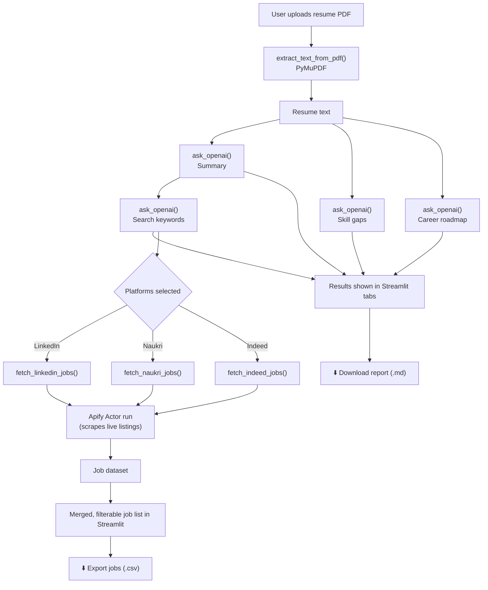
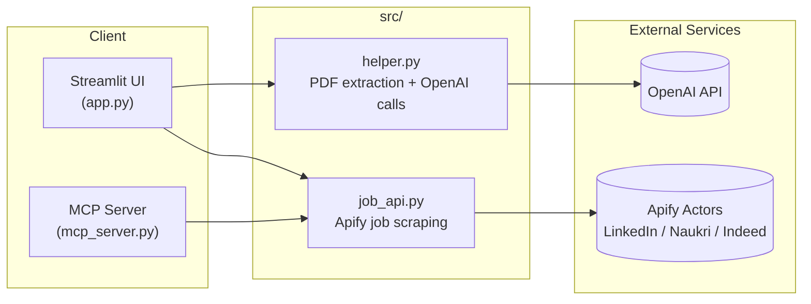

# 🧭 AI Job Recommender

A Streamlit app that reads your resume (PDF), uses OpenAI to summarize it, spot skill gaps, and build a career roadmap — then searches **LinkedIn**, **Naukri**, and **Indeed** in real time (via Apify actors) for jobs that match. The same job-search logic is also exposed as **MCP tools**, so any MCP-compatible client (e.g. Claude Desktop) can call it directly.

## Features

- 📖 Resume text extraction from PDF (PyMuPDF)
- 📑 AI-generated resume summary, skill-gap analysis, and career roadmap (OpenAI `gpt-4o-mini`)
- 🔑 Automatic extraction of job-search keywords from the resume
- 💼 Live job search across LinkedIn, Naukri, and Indeed (Apify actors)
- 🔎 Filter/search fetched jobs by title, company, location, or platform
- ⬇️ Export the analysis report (Markdown) and job matches (CSV)
- 🔌 MCP server exposing job search as tools for MCP clients

## How It Works



## Architecture



- **`app.py`** — Streamlit UI: resume upload, analysis pipeline, job search, results display.
- **`mcp_server.py`** — Exposes `fetchlinkedin`, `fetchnaukri`, and `fetchindeed` as MCP tools (stdio transport) so external MCP clients can trigger job searches.
- **`src/helper.py`** — PDF text extraction and OpenAI chat completion calls.
- **`src/job_api.py`** — Apify client wrappers that run the LinkedIn, Naukri, and Indeed scraper actors and return the resulting job listings.

## Tech Stack

| Layer | Technology |
|---|---|
| UI | [Streamlit](https://streamlit.io/) |
| LLM | [OpenAI](https://platform.openai.com/) (`gpt-4o-mini`) |
| PDF parsing | [PyMuPDF](https://pymupdf.readthedocs.io/) (`fitz`) |
| Job scraping | [Apify](https://apify.com/) actors via `apify-client` |
| MCP integration | [`mcp`](https://modelcontextprotocol.io/) (FastMCP, stdio transport) |
| Package management | [`uv`](https://docs.astral.sh/uv/) |

## Project Structure

```
Real_Time_Job_Recommendation/
├── app.py              # Streamlit app entry point
├── mcp_server.py        # MCP server exposing job-search tools
├── src/
│   ├── helper.py         # PDF text extraction + OpenAI calls
│   └── job_api.py        # Apify job-scraping wrappers
├── pyproject.toml        # Project dependencies (uv)
├── requirements.txt      # Project dependencies (pip)
└── .env                  # API keys (not committed)
```

## Setup

### 1. Clone and install dependencies

Using `uv` (recommended):

```bash
uv sync
```

Or with `pip`:

```bash
pip install -r requirements.txt
```

### 2. Configure environment variables

Create a `.env` file in the project root:

```env
OPENAI_API_KEY="your-openai-api-key"
APIFY_API_TOKEN="your-apify-api-token"
```

| Variable | Description |
|---|---|
| `OPENAI_API_KEY` | OpenAI API key used for resume analysis |
| `APIFY_API_TOKEN` | Apify API token used to run the LinkedIn/Naukri/Indeed scraper actors |

### 3. Run the Streamlit app

```bash
uv run streamlit run app.py
```

Then open the URL Streamlit prints (default `http://localhost:8501`).

### 4. (Optional) Run the MCP server

```bash
uv run mcp_server.py
```

This starts an MCP server over stdio exposing `fetchlinkedin`, `fetchnaukri`, and `fetchindeed` tools for use by MCP-compatible clients.

## Usage

1. Upload a text-based PDF resume in the sidebar.
2. Set your job search preferences (location, platforms, number of results).
3. Click **Analyze Resume** to generate a summary, skill-gap analysis, roadmap, and search keywords.
4. Switch to the **Job Matches** tab and click **Find Matching Jobs** to fetch live listings.
5. Filter results, then export the report or job list as needed.
